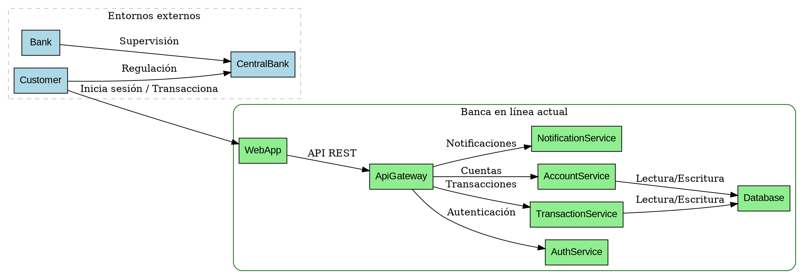
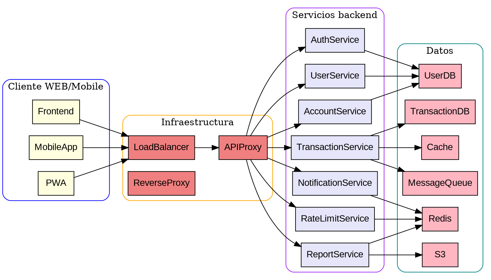
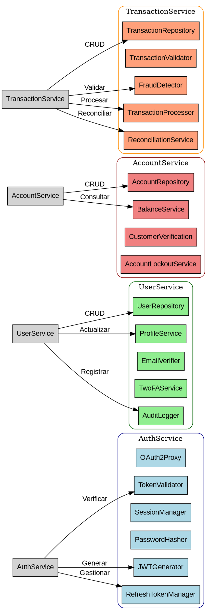
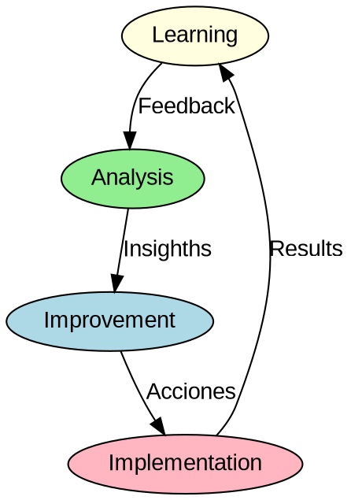
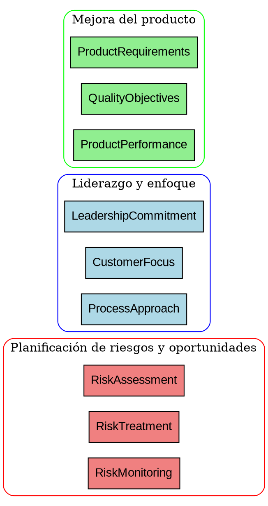

# Plantillas de Documentación C4

## 1. C4 Diagrama de Contexto



## 2. Plantilla de Contenedores C4



## 3. Plantilla de Componentes C4



## 4. Plantilla de Diagrama de Código C4

```dot
// Diagrama de Dependencias de Código C4 - Implementación técnica
// *************************************************************

 digraph G {
    rankdir=LR;
    node [shape=box, style=filled, fontname="Courier", fontsize=10];
    edge [fontname="Arial"];

    // Java / Spring Boot Services
    subgraph cluster_java {
        label = "Servicios Java";
        style = rounded;
        color = darkblue;
        fillcolor = aliceblue;

        domain [fillcolor=aliceblue];
        service [fillcolor=aliceblue];
        repository [fillcolor=aliceblue];
        config [fillcolor=aliceblue];
        security [fillcolor=aliceblue];
    }

    // Frameworks y dependencias
    subgraph cluster_framework {
        label = "Spring Boot / Frameworks";
        style = rounded;
        color = blue;
        fillcolor = lightcyan;

        spring_boot [fillcolor=lightcyan];
        spring_data_jpa [fillcolor=lightcyan];
        spring_security [fillcolor=lightcyan];
        lombok [fillcolor=lightcyan];
        jackson [fillcolor=lightcyan];
        validation [fillcolor=lightcyan];
    }

    // Tecnologías de base de datos
    subgraph cluster_db {
        label = "Base de datos relacional";
        style = rounded;
        color = green;
        fillcolor = lightyellow;

        h2 [fillcolor=lightyellow];
        postgresql [fillcolor=lightyellow];
        flyway [fillcolor=lightyellow];
        hibernate [fillcolor=lightyellow];
    }

    // Infraestructura cloud
    subgraph cluster_cloud {
        label = "Cloud/AWS";
        style = rounded;
        color = orange;
        fillcolor = moccasin;

        aws_sdk [fillcolor=moccasin];
        aws_s3 [fillcolor=moccasin];
        aws_sqs [fillcolor=moccasin];
        aws_secrets_manager [fillcolor=moccasin];
    }

    // Conexiones entre capas

    // Spring Boot con framework
    spring_boot -> spring_data_jpa [label="Usa"];
    spring_boot -> spring_security [label="Usa"];
    spring_boot -> lombok [label="Usa"];
    spring_boot -> jackson [label="Usa"];
    spring_boot -> validation [label="Usa"];

    // Framework con código
    spring_data_jpa -> repository [label="Interfaz"];
    spring_security -> security [label="Módulo"];

    // Framework con BD
    spring_data_jpa -> hibernate [label="Usa"];
    spring_data_jpa -> postgresql [label="Almacena"];
    hibernate -> h2 [label="Almacena"];
    hibernate -> postgresql [label="Almacena"];
    flyway -> postgresql [label="Migraciones"];

    // Base de datos con AWS
    postgresql -> aws_secrets_manager [label="Credenciales"];
    h2 -> aws_secrets_manager [label="Credenciales"];
    aws_s3 -> h2 [label="Backup"], postgresql [label="Archivar"];
    aws_sqs -> h2 [label="Colas"], postgresql [label="Colas"];

    // Servicios con AWS
    service -> aws_sdk [label="Usa"];
    service -> aws_s3 [label="Archivar"];
    service -> aws_sqs [label="Colas de mensajes"];

    // Repositorio con base de datos
    repository -> hibernate [label="Usa"];
    repository -> postgresql [label="Conecta a"];

    // Config con múltiples
    config -> postgresql [label="Conecta a"];
    config -> h2 [label="Conecta a"];
    config -> aws_secrets_manager [label="Credenciales"];
}
```

## 5. Ejemplo de Patrones de Arquitectura ISO

Las siguientes plantillas demuestran cómo documentar los principios clave de ISO 9001 en formato C4:

### a) Mejora Continua



### b) Enfoque basado en procesos


