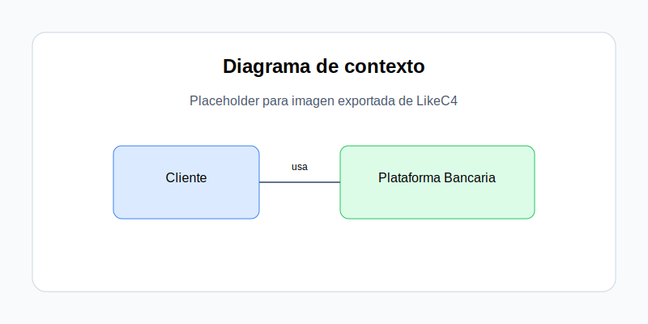
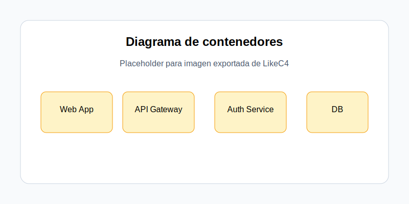
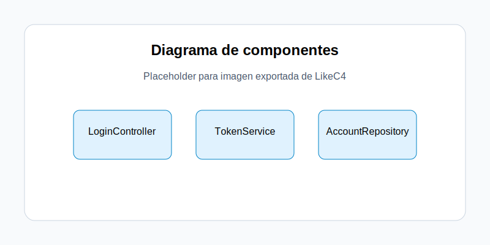

# Documentación de arquitectura LikeC4

Esta guía referencia los diagramas del proyecto LikeC4 y mantiene separados los fuentes `.c4` de las imágenes exportadas.

## Diagramas disponibles

### 1. Diagrama de contexto

Fuente: [../diagrams/context.c4](../diagrams/context.c4)

### 2. Diagrama de contenedores

Fuente: [../diagrams/containers.c4](../diagrams/containers.c4)

### 3. Diagrama de componentes

Fuente: [../diagrams/components.c4](../diagrams/components.c4)

## Recomendación de flujo de trabajo

1. Actualiza el archivo `.c4` correspondiente.
2. Exporta o guarda la imagen equivalente en `images/`.
3. Referencia la imagen desde esta documentación para mantenerla visible.
